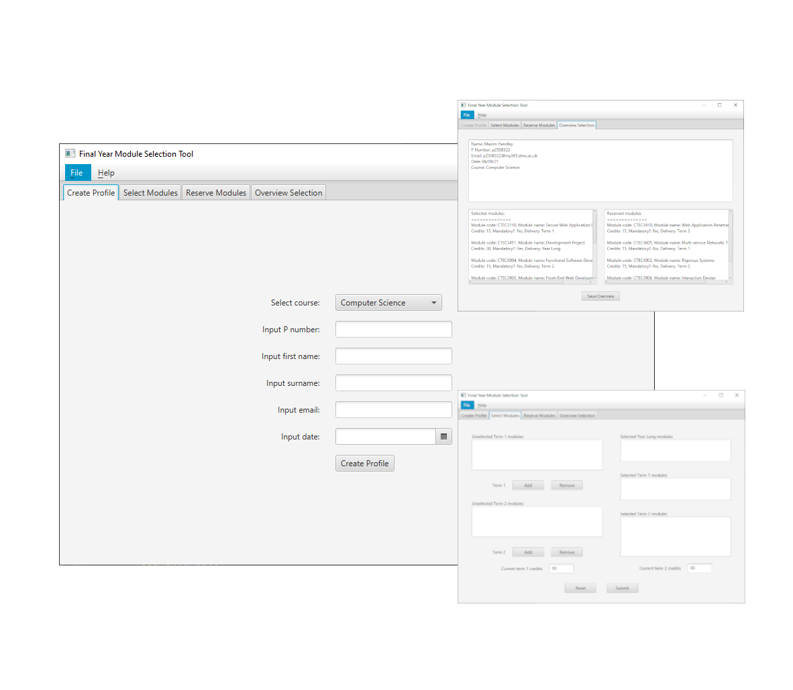

# ModuleSelectionTool
 A desktop utility built using JavaFX for students planning their final year modules as part of
 the CTEC2906 Object Oriented Development to demonstrate the following concepts:
 - Inheritence, encapsulation, polymorphism.
 - MVC.
 - Callbacks & Nested classes.
 - Functional interfaces.
 - Collections.
 - Stream pipelines/operations.
 - Files/IO/Exceptions.
 - GUIs.
 - Event Handling.

